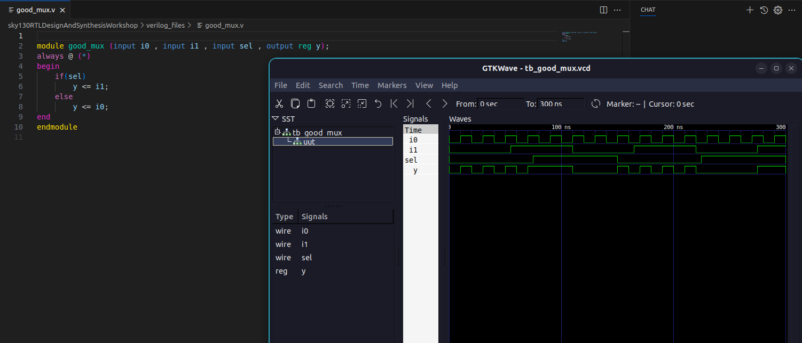

# **🚀 Week1**

### -Cloning the Workshop Repository

```bash
git clone https://github.com/kunalg123/sky130RTLDesignAndSynthesisWorkshop
cd sky130RTLDesignAndSynthesisWorkshop
```

### Introduction to Iverilog and GTKWave

⇒Simulate Mux using gtkwave


### ⚙️ Task 1 – Yosys Optimization with `opt_clean -purge`

⇒In this task, we explored **logic optimization** in the synthesis flow using **Yosys**, an open-source RTL synthesis tool. Yosys performs several passes to transform a high-level RTL design (in Verilog) into an optimized gate-level netlist. One of the important passes in this flow is 

```bash
opt_clean
```

, which helps in **removing unused or redundant logic** after synthesis.

---

### ⚙️ **Flow :**

By following the steps below, we can **optimize the RTL design and generate a clean, technology-mapped netlist** using Yosys.

| **Step** | **Command** | **Purpose** |
| --- | --- | --- |
| 1️⃣ | `read_liberty -lib ../my_lib/lib/sky130_fd_sc_hd__tt_025C_1v80.lib` | Load standard cell library |
| 2️⃣ | `read_verilog opt_check4.v` | Load RTL design |
| 3️⃣ | `synth -top opt_check4` | Run synthesis |
| 4️⃣ | `opt_clean -purge` |  Remove unused nets, dangling cells |
| 5️⃣ | `abc -liberty ../my_lib/lib/sky130_fd_sc_hd__tt_025C_1v80.lib` | Map to technology cells |
| 6️⃣ | `show` | View netlist visually |

### Results after Optimization with `opt_clean -purge`

### 1.opt_check4.v


### **2.multiple_module_opt.v**

Without Optimization :


With Optimiztions:


### **Key Takeaways**

- Waveform verification after the optimization confirmed that the **design functionality remained unchanged**.
- The resulting netlist was **smaller and cleaner**, making downstream processes like placement and routing more efficient.
- Running `opt_clean -purge` after synthesis removed unused flip-flops and intermediate wires that were left in the design.

## **Yosys Synthesis & GLS Flow**

The following Yosys command sequence demonstrates a **complete synthesis and optimization flow** for generating a gate-level netlist from an RTL design

```bash
# 1. Import the Sky130 standard-cell library (provides cell timing and logic data)
read_liberty -lib ../my_lib/lib/sky130_fd_sc_hd__tt_025C_1v80.lib

# 2. Read in the Verilog RTL source file
read_verilog mux_generate.v

# 3. Perform synthesis for the chosen top-level module
synth -top mux_generate

# 4. (Optional) Collapse all sub-modules into a single flat hierarchy
flatten

# 5. Map all sequential elements (like D-flip-flops) to cells from the loaded library
dfflibmap -liberty ../my_lib/lib/sky130_fd_sc_hd__tt_025C_1v80.lib

# 6. Clean up the design by removing unconnected nets and unnecessary gates
opt_clean -purge

# 7. Use ABC for further logic optimization and technology-specific cell mapping
abc -liberty ../my_lib/lib/sky130_fd_sc_hd__tt_025C_1v80.lib

# 8. Run a final cleanup pass to discard any leftover unused wires/cells
clean

# 9. (Optional) Re-flatten the design if required after mapping
flatten

# 10. Export the final gate-level netlist as a Verilog file
write_verilog -noattr mux_generate_GLS.v

# 11. Produce a schematic view for easy visualization of the synthesized design
show -format png -prefix mux_generate_show
```

## **Task 2 – Constant DFF Mapping & GLS**

**🎯 Objective**

Understand how **Yosys handles constant-driven flip-flops** (`const4.v`, `const5.v`) and verify the design with **Icarus Verilog simulation (GLS)**.

---

**⚙️ Yosys Synthesis Flow this task**

| **Step** | **Command** | **Purpose** |
| --- | --- | --- |
| 1️⃣ | `read_liberty -lib ../my_lib/lib/sky130_fd_sc_hd__tt_025C_1v80.lib` | Load standard-cell library |
| 2️⃣ | `read_verilog const4.v` | Read RTL source |
| 3️⃣ | `synth -top const4` | Run synthesis |
| 4️⃣ | `dfflibmap -liberty ../my_lib/lib/sky130_fd_sc_hd__tt_025C_1v80.lib` | Map flip-flops to technology cells |
| 5️⃣ | `abc -liberty ../my_lib/lib/sky130_fd_sc_hd__tt_025C_1v80.lib` | Optimize & tech-map logic |
| 6️⃣ | `write_verilog const4_net.v` | Save synthesized netlist |

---

**🖥️ Icarus Verilog GLS Flow**

```bash
iverilog const4.v tb_const4.v
./a.out
```

(Similar commands used for `const5.v`).

1. dff_const4.v:
- Both **`q` and `q1`** latch a constant `1`.
- Yosys maps this with a **buffer** to maintain the constant-driven path.

✅ Simulation confirms constant outputs:


1. dff_const5.v :
- When **reset = 1** → `q = q1 = 0`.
- When **reset = 0** → `q1 = 1` and `q = q1`.
- Yosys synthesis here correctly produces **two separate flip-flops**.

✅ Simulation matches expected reset behavior:


### **Key Learnings**

- 🔗 **Constant propagation** works seamlessly in Yosys.
- 🧩 **Buffers may appear** when constants need to drive multiple outputs.
- 🕹️ **Reset handling** ensures flops behave exactly as written in RTL.
- ⏱️ GLS validates **functional correctness**, but **timing is not included** (since `.lib` doesn’t have delay models in this flow).
