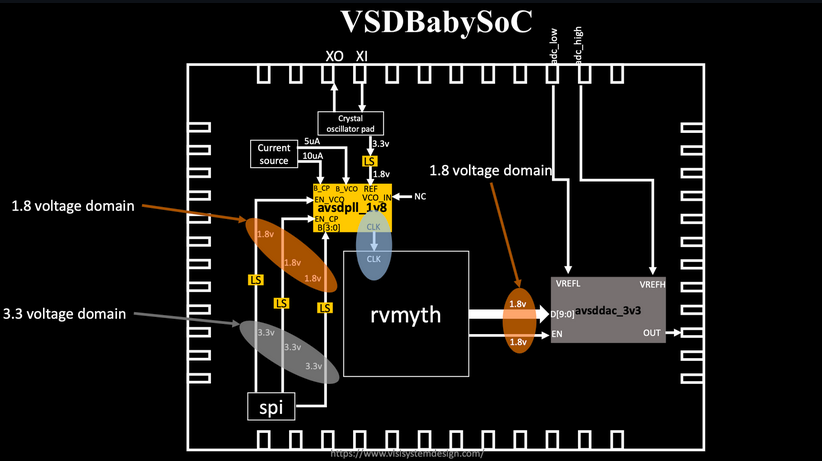

# 🧠 Fundamentals of System-on-Chip (SoC) Design

---

## ⚙️ What is a System-on-Chip (SoC)?

A **System-on-Chip (SoC)** is an **integrated circuit** that combines all essential components of a system onto a **single silicon chip**.

By integrating multiple system components into one chip, SoCs simplify **circuit board design**, improve **performance** and **power efficiency**, and reduce **overall size and cost** — without compromising functionality.

### 🧩 Typical Components of an SoC
- Data Processing Units (CPU / RISC-V Core)
- Embedded Memory (SRAM / DRAM)
- Graphics Processing Units (GPUs)
- USB Interfaces
- Video and Audio Processing Units

---

### 🌟 Advantages of System-on-Chip

1. **Space Optimization:**  
   Combines multiple modules into one chip, enabling **compact and lightweight** devices.

2. **Power Efficiency:**  
   Replaces large discrete components, resulting in **lower power consumption** and improved **PPA** (Power, Performance, Area).

3. **Cost-Effective:**  
   A single SoC is **cheaper** than multiple separate chips, reducing manufacturing cost.

4. **High Reliability:**  
   Fewer external interconnections increase **signal integrity** and **system reliability**.

5. **Enhanced Performance:**  
   On-chip communication enables **faster data transfer** and **higher operating speeds**.

---

## 🌀 The SoC Design Flow


---

## 🧱 Types of SoCs

| SoC Type | Key Feature | Ideal Applications |
|----------|--------------|--------------------|
| **Microcontroller-based** | Built around a **low-power MCU** | Best for **IoT devices**, **wearables**, and **home appliances** focused on efficiency and low power. |
| **Microprocessor-based** | Includes a **high-performance CPU** | Used in **smartphones**, **tablets**, and **embedded systems** that require operating systems and complex applications. |

---

> ✨ **In Summary:**  
> SoCs integrate multiple subsystems into a single chip, achieving **compactness**, **efficiency**, and **high performance**.  
> They are the foundation of **modern electronics**, powering devices from **IoT sensors** to **smartphones** and **AI accelerators**.

---

# VSDBabySoC: A Compact Mixed-Signal RISC-V SoC

---

## **🌟 Introduction**

The **VSDBabySoC** is an open-source, educational **System-on-Chip** 💡, designed to unite and validate open-source analog and digital components. It features three core IPs:

- 🧠 **Processor (RVMYTH)**: A simple, easy-to-experiment-with **RISC-V core** built in TL-Verilog.
- ⏰ **PLL (AVSDPLL)**: An integrated **Phase-Locked Loop** for generating a stable, internal clock signal.
- **DAC (AVSDDAC, 10-bit)**: A **Digital-to-Analog Converter** for interacting with external analog systems. 🔊

*The core goals of **VSDBabySoC** are to **validate the integration of analog and digital IPs** and to serve as an **educational platform** for the open-source fabrication flow (e.g., SkyWater 130 nm PDK). 🔬🎓*



---

## **📂 Project Structure**


```text
VSDBabySoC/
├── src/
│   ├── include/        # Header files (*.vh)
│   ├── module/         # Verilog + TLV modules
│   │   ├── vsdbabysoc.v   # Top-level module
│   │   ├── rvmyth.v       # CPU
│   │   ├── avsdpll.v      # PLL
│   │   ├── avsddac.v      # DAC
│   │   └── testbench.v    # Testbench
└── output/             # Simulation outputs


```
## **🛠️ Setup**

---

```text

# --- 1. INSTALL PREREQUISITES ---

# Install essential system packages (make, python, docker)
sudo apt install make python python3 python3-pip docker.io

# Set permissions for Docker socket to allow access
sudo chmod 666 /var/run/docker.sock

# Navigate to home directory
cd ~

# Install required Python libraries
pip3 install pyyaml click sandpiper-saas


# --- 2. CLONE REPOSITORY ---

# Navigate to your preferred location
cd VSD_tapeout

# Clone the VSDBabySoC repository
git clone https://github.com/manili/VSDBabySoC.git
```

### **🔧 TLV → Verilog Conversion**
---

Since **RVMYTH** is written in **TL-Verilog (.tlv)**, we need to convert it to Verilog before simulating.

## Simulation Flow
---

### **🔹 Pre-Synthesis Simulation**

```text
# --- RUN SIMULATION & GENERATE WAVEFORMS ---

# Navigate into the cloned project directory
cd VSDBabySoC

# Execute the pre-synthesis simulation (generates output/pre_synth_sim/pre_synth_sim.vcd)
make pre_synth_sim

# ---  VIEW WAVEFORMS ---

# Open the generated waveform file in GTKWave viewer
gtkwave output/pre_synth_sim/pre_synth_sim.vcd
```

## VSDBabySoC Key Signals To Observe

- **CLK**: This is the input clock signal for the **RVMYTH core**, which is originally sourced from the on-chip **Phase-Locked Loop (PLL)**. ⏰
- **reset**: This is the input reset signal for the **RVMYTH core**, originally coming from an **external source**. 🔁
- **OUT (Top Level)**: This represents the main final output of the **VSDBabySoC** module. It's derived from the **Digital-to-Analog Converter (DAC)**. (Note: Due to simulation constraints, it currently appears as a digital signal). 🔌
- **RV_TO_DAC[9:0]:** This is the **10-bit digital output** port from the **RVMYTH core**. Its value is controlled by data held in the core's **Register #17**. 🔢
- **OUT (Real Wire)**: This is a **real datatype wire** located within the DAC module itself. It's used to **simulate the actual analog voltage value** output by the DAC. 🔊

### **📈 Pre_synth_sim Waveform**


### DAC Output Calculation

The analog output voltage is calculated using the standard DAC transfer function:

$$
V_{out} = V_{ref} \times \left( \frac{D}{2^N - 1} \right)
$$

### 1. Identify Parameters

| Parameter | Value | Source/Role |
| --- | --- | --- |
| **N** (Bits) | 10 | DAC resolution (from `RV_TO_DAC[9:0]`) |
| **D** (Digital Code) | 378 | Processor output (`RV_TO_DAC[9:0]`) |
| **Vref** (Reference Voltage) | 1.0 V | Inferred from the simulation model |
|  |  |  |

$$
\text{Max Code} = 2^N - 1 = 2^{10} - 1 = \mathbf{1023}
$$

### 3. Calculate Analog Output

Substitute the values into the DAC formula to find the resulting analog output voltage ($\text{OUT(DAC)}$):

$$
V_{out} = 1.0 \text{ V} \times \left( \frac{378}{1023} \right)
$$

$$
V_{out} \approx \mathbf{0.369501466 \text{ V}}
$$

This calculated value of $\mathbf{0.369501466 \text{ V}}$ is precisely the simulated analog output shown on the **OUT (Real Wire)** in the waveform for a digital input of $378$, confirming the correct operation of the DAC.

### References

* [VSD Baby SoC]( https://github.com/manili/VSDBabySoC )
* [Spath VSD](https://github.com/spatha0011/spatha_vsd-hdp/tree/main/Day5)
