# **VSDBabySoC Post-Synthesis Simulation**

### 🧩 Post-Synthesis Overview

**Post-synthesis** refers to the stage after the **RTL (Register Transfer Level)** design has been **synthesized** into a **gate-level netlist** using a standard cell library (e.g., Sky130).

During synthesis, high-level Verilog code is converted into a network of logic gates that can be physically realized on silicon. The synthesis tool (like **Yosys**) maps the design onto standard cells defined in `.lib` files, optimizing for **area**, **timing**, and **power**.

🔹 **Key Steps in Post-Synthesis**

| **Step** | **Description** |
| --- | --- |
| **1. Netlist Generation** | The RTL design is translated into a **gate-level netlist** composed of logic gates, flip-flops, and interconnections from the standard cell library. |
| **2. Library Mapping** | Each logical element in the RTL is mapped to a **technology-dependent cell** (e.g., NAND, NOR, INV, DFF) defined in the PDK’s `.lib` file. |
| **3. Static Timing Analysis (STA)** | Performs **timing checks** to ensure that the synthesized design meets **setup and hold time** requirements across all timing paths. |
| **4. Gate-Level Simulation (GLS)** | Simulates the **post-synthesis netlist** (using tools like *Icarus Verilog*) to verify that the functionality remains correct after synthesis using the same testbench as the RTL. |

## **Synthesis & Netlist Generation Flow:**

### **Step 1: Initialize the Top Module and Its Dependencies**
```bash
read_verilog src/module/vsdbabysoc.v

read_verilog -I /home/rajdeep/Risc-VSoCTapeout/VSDBabySoC/src/include/ /home/rajdeep/Risc-VSoCTapeout/VSDBabySoC/output/compiled_tlv/rvmyth.v

read_verilog -I /home/rajdeep/Risc-VSoCTapeout/VSDBabySoC/src/include/ /home/rajdeep/Risc-VSoCTapeout/VSDBabySoC/src/module/clk_gate.v
```
### **Step 2: Load the Liberty Files for Synthesis**
```bash
read_liberty -lib src/lib/avsdpll.lib
read_liberty -lib src/lib/avsddac.lib
read_liberty -lib src/lib/sky130_fd_sc_hd__tt_025C_1v80.lib
```
**Step 3: Run Synthesis Targeting `vsdbabysoc`**
``` bash
yosys> synth -top vsdbabysoc`
```
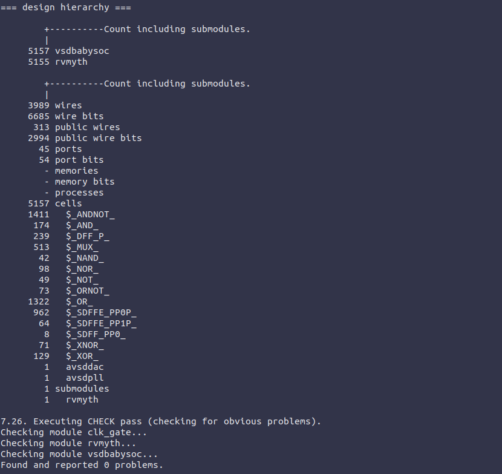

**Step 4: Map D Flip-Flops to Standard Cells**

```bash
>dfflibmap -liberty /home/rajdeep/Risc-VSoCTapeout/VSDBabySoC/src/lib/sky130_fd_sc_hd__tt_025C_1v80.lib
```

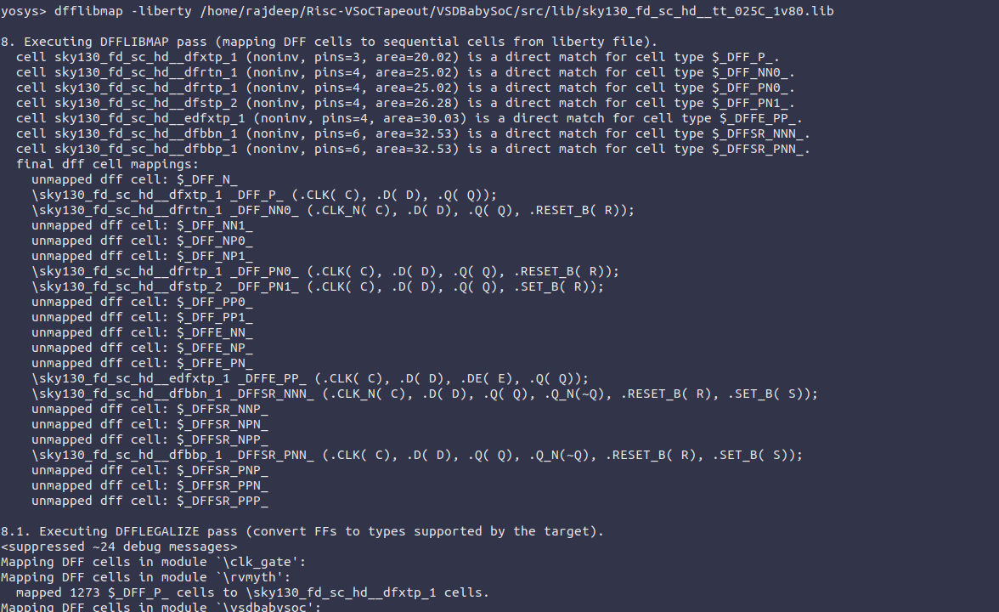
**Step 5: Perform Optimization and Technology Mapping**

```bash
>opt
>abc -liberty /home/rajdeep/Risc-VSoCTapeout/VSDBabySoC/src/lib/sky130_fd_sc_hd__tt_025C_1v80.lib
```

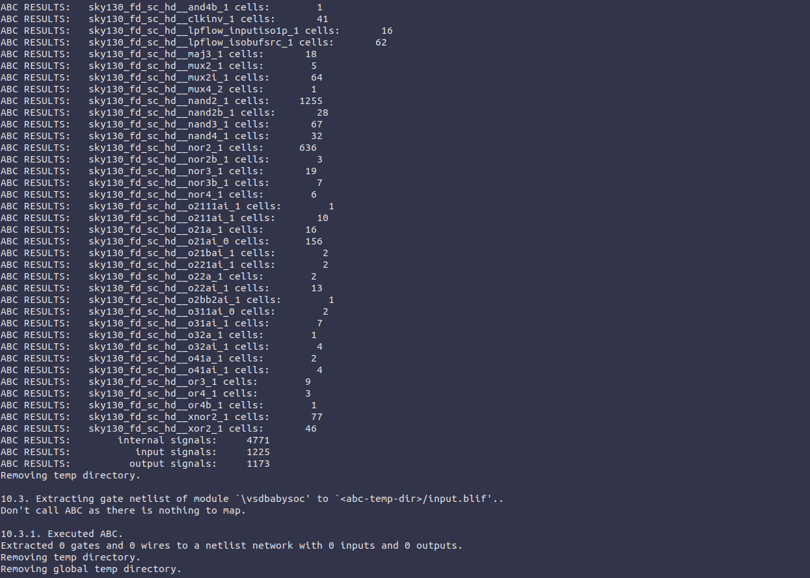

**Step 6: Perform Final Clean-Up and Renaming**

```bash
yosys> flatten
yosys> setundef -zero
yosys> clean -purge
yosys> rename -enumerate
```

**Step 7: Check Statistics**

stat

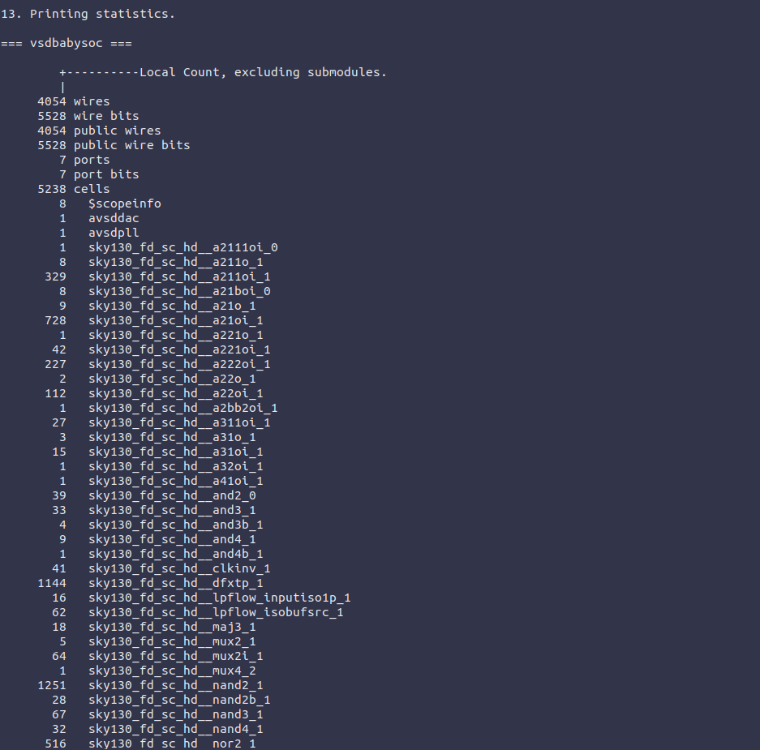

**Step 8: Write the Synthesized Netlist**

```bash
yosys> write_verilog -noattr /home/rajdeep/Risc-VSoCTapeout/VSDBabySoC/output/post_synth_sim/vsdbabysoc.synth.v
```


## **POST_SYNTHESIS SIMULATION AND WAVEFORMS**

**Step 1: Compile the Testbench**

```kotlin
rajdeep@Rajdeep:~/Risc-VSoCTapeout/VSDBabySoC$ iverilog -o /home/rajdeep/Risc-VSoCTapeout/VSDBabySoC/output/post_synth_sim/post_synth_sim.out -DPOST_SYNTH_SIM -DFUNCTIONAL -DUNIT_DELAY=1 -I /home/rajdeep/Risc-VSoCTapeout/VSDBabySoC/src/include/ -I /home/rajdeep/Risc-VSoCTapeout/VSDBabySoC/src/module/ /home/rajdeep/Risc-VSoCTapeout/VSDBabySoC/src/module/testbench.v
```

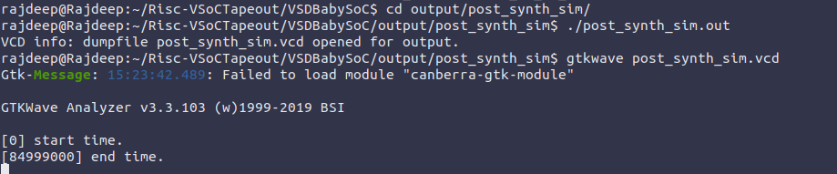

**Post Synthesis Simulation Waveform**

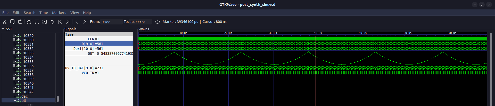

**Comparisor Between Pre Synthesis and Post Synthesis**

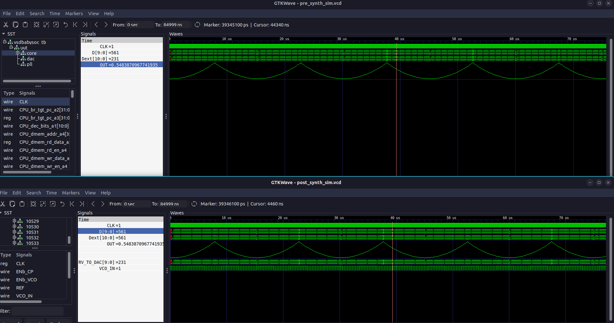

## ⏱️ Static Timing Analysis (STA)

**Static Timing Analysis (STA)** is a crucial step in the digital design flow used to **verify the timing performance** of a synthesized circuit without requiring dynamic simulation.

Instead of applying input vectors, STA analyzes all possible timing paths in the design to ensure that signals propagate within the required clock period.

It checks critical parameters such as **setup time**, **hold time**, **clock skew**, and **path delays** across combinational and sequential elements. 

**🔹 Components of Static Timing Analysis (STA)**

| **Type** | **Description** |
| --- | --- |
| **1. Check Files** | These define the **timing checks** such as **setup**, **hold**, **recovery**, and **removal** times that must be verified to ensure proper data transfer between flip-flops and across logic paths. |
| **2. Constraint Files** | Contain **timing constraints** (usually in `.sdc` format) such as **clock definitions**, **input/output delays**, and **false/multicycle paths**. These guide the STA tool on how to analyze and validate timing for the design. |
| **3. Library Files** | Standard cell **timing libraries** (in `.lib` format) provide information about **cell delays**, **setup/hold times**, **power**, and **process variations**. STA uses these to calculate accurate path delays during analysis. |

**Setup time & Hold Time:**

| **Term** | **Definition** |
| --- | --- |
| **Setup Time** | The **minimum amount of time** before the active clock edge during which the input data of a flip-flop must remain **stable**. If data changes too close to the clock edge (violating setup time), the flip-flop may capture incorrect data or become metastable. |
| **Hold Time** | The **minimum amount of time** after the active clock edge during which the input data must remain **stable**. If data changes too soon after the clock edge (violating hold time), the output may become unpredictable. |

### **STA in CMOS Design Flow**

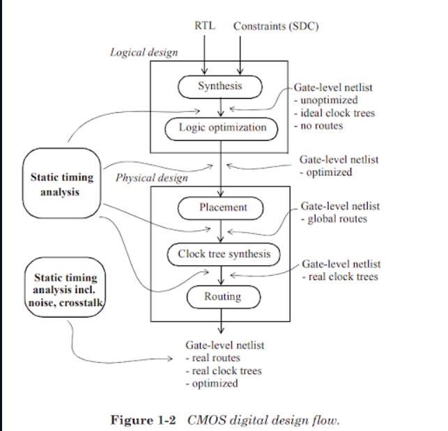

# OpenSTA

### **Introduction**

OpenSTA, an open-source static timing analyzer, is used to check and ensure the timing correctness of gate-level digital designs.

OpenSTA uses a TCL-based command interface to read designs, apply timing constraints, and produce timing analysis reports.

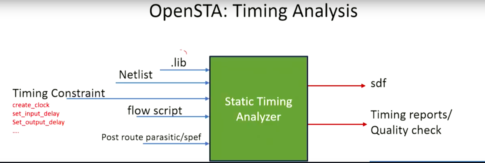

**Input Files**

- `.v` : Gate-level Verilog Netlist
- `.lib` : Liberty Timing Libraries
- `.sdc` : Synopsys Design Constraints (clocks, delays, false paths)
- `.sdf` : Annotated Delay File (optional)
- `.spef`: Parasitics (RC extraction)
- `.vcd` / `.saif` : Switching Activity for Power Analysis

**Clock Modeling Features**

- `Generated Clocks`: Derived from existing clocks
- `Latency`: Clock propagation delay
- `Source Latency`: Insertion delay from clock source to input
- `Uncertainty`: Jitter or skew margins
- `Propagated vs. Ideal`: Real vs. ideal clock network modeling
- `Gated Clock Checks`: Verifies clocks that are enabled conditionally
- `Multi-Frequency Clocks`: Analyzes multiple domains

**Exception Paths**

Timing exceptions refine analysis for real behavior:

- `set_false_path` — Ignores invalid functional paths
- `set_multicycle_path` — Allows multiple clock cycles
- `set_max_delay` / `set_min_delay` — Custom timing limits

## ⏱️ Timing Paths in STA

**Definition:**

Timing paths are the logical routes a signal takes through a digital circuit, from its source to its destination, passing through sequential and combinational elements. STA analyzes these paths to determine delays, setup and hold times, and other timing parameters.

### 🔹 Timing Path Elements

- **Start Point:**
    - Where the signal originates.
    - Can be an **input port** (data enters the design) or a **clock pin of a register** (data is launched on a clock edge).
- **End Point:**
    - Where the signal terminates.
    - Can be a **register’s D input pin** (data captured on clock edge) or an **output port** (data must arrive at a specific time).
- **Combinational Logic:**
    - Logic gates through which the signal passes.
    - Do **not store data**; output depends solely on current inputs.

### 🔹 Types of Timing Paths

- Input to Register (in2reg)
- Register to Register (reg2reg)
- Register to Output (reg2out)
- Input to Output (in2out)

### **Critical Path:**

- The **longest timing path** in the design.
- Determines the **maximum operating frequency** of the circuit.

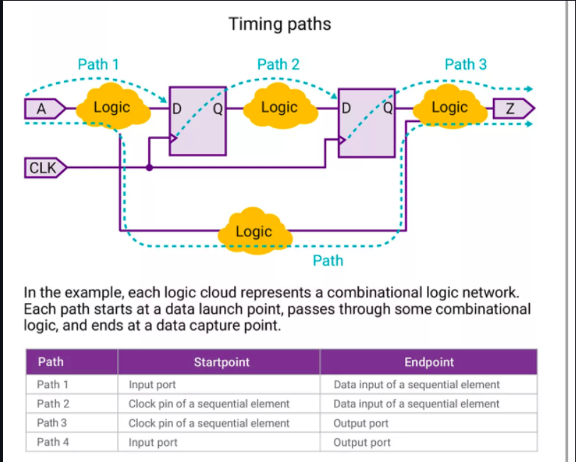

### 🔹 Setup Check

- Minimum time **data must be stable before the clock edge**.
- Violating setup time can cause **incorrect data storage** in flip-flops.
- Depends on **technology node, operating conditions**, and logic library specifications.

### 🔹 Hold Check

- Minimum time **data must remain stable after the clock edge**.
- Violating hold time can lead to **data corruption or metastability**.
- Ensures sequential elements capture correct data reliably.

### 🔹 Data Arrival Time (DAT)

- Time taken by a signal to travel from the **start point to the end point** of a timing path.

### 🔹 Data Required Time (DRT)

- The **latest time** a signal must arrive at the endpoint to satisfy timing constraints, determined by the clock path.

### 🔹 Slack

- **Slack = Required Time − Arrival Time** (for setup)
- **Slack = Arrival Time − Required Time** (for hold)
- **Positive Slack:** Timing met, can still improve.
- **Zero Slack:** Critical timing, operating at max frequency.
- **Negative Slack:** Timing violation, design does not meet specified frequency.

### **🧾 Common SDC Constraints**

SDC defines **timing, environment, and power requirements** of a design.

| **Category** | **Example Commands** |
| --- | --- |
| **Operating Conditions** | `set_operating_conditions` |
| **Wire-load Models** | `set_wire_load_mode`, `set_wire_load_model`, `set_wire_load_selection_group` |
| **Environmental** | `set_drive`, `set_driving_cell`, `set_load`, `set_input_transition` |
| **Design Rules** | `set_max_capacitance`, `set_max_fanout`, `set_max_transition` |
| **Timing** | `create_clock`, `set_clock_latency`, `set_input_delay`, `set_output_delay` |
| **Exceptions** | `set_false_path`, `set_multicycle_path`, `set_max_delay` |
| **Power** | `set_max_dynamic_power`, `set_max_leakage_power` |

### **🧭 Summary**

OpenSTA enables efficient **post-synthesis timing verification** by:

- Ensuring design meets **setup/hold timing** across all paths
- Supporting **complex clock models** and **multi-cycle exceptions**
- Allowing flexible **delay calculation** and **constraint definition**

---

> 📘 Static Timing Analysis ensures your design performs reliably at its target clock frequency.
> 

## **Step by Step Installation of OpenSTA**

**1.Clone the Repository**

```bash
git clone https://github.com/parallaxsw/OpenSTA.git
cd OpenSTA
```

**2.Build the Docker Image**

```bash
docker build --file Dockerfile.ubuntu22.04 --tag opensta .
```

**3.Run the OpenSTA Container**

```bash
docker run -i -v $HOME:/data opensta
```

Once inside the container (`%` prompt), OpenSTA is ready to use.

# **⚙️ VSDBabySoC Timing Analysis with OpenSTA**

Prepare all the files

files must include:

- Standard cell library: sky130_fd_sc_hd__tt_025C_1v80.lib
- IP-specific Liberty libraries: avsdpll.lib, avsddac.lib
- Synthesized gate-level netlist: vsdbabysoc.synth.v
- Timing constraints: vsdbabysoc_synthesis.sdc

## **🕒 Run Min/Max Delay Timing Checks**

Below is the TCL script to perform **complete min/max timing analysis** on the SoC:

```bash
read_liberty -min /data/VLSI/VSDBabySoC/OpenSTA/examples/timing_libs/sky130_fd_sc_hd__tt_025C_1v80.lib
read_liberty -max /data/VLSI/VSDBabySoC/OpenSTA/examples/timing_libs/sky130_fd_sc_hd__tt_025C_1v80.lib

read_liberty -min /data/VLSI/VSDBabySoC/OpenSTA/examples/timing_libs/avsdpll.lib
read_liberty -max /data/VLSI/VSDBabySoC/OpenSTA/examples/timing_libs/avsdpll.lib

read_liberty -min /data/VLSI/VSDBabySoC/OpenSTA/examples/timing_libs/avsddac.lib
read_liberty -max /data/VLSI/VSDBabySoC/OpenSTA/examples/timing_libs/avsddac.lib

read_verilog /data/VLSI/VSDBabySoC/OpenSTA/examples/BabySOC/vsdbabysoc.synth.v
link_design vsdbabysoc

read_sdc /data/VLSI/VSDBabySoC/OpenSTA/examples/BabySOC/vsdbabysoc_synthesis.sdc

report_checks
```

🔹 OpenSTA Commands and Their Functions

| **Command** | **Purpose / Description** |
| --- | --- |
| `read_liberty -min <file>` | Loads the **minimum timing values** from a standard cell library. Used for **setup checks** and worst-case delay analysis. |
| `read_liberty -max <file>` | Loads the **maximum timing values** from a standard cell library. Used for **hold checks** and best-case delay analysis. |
| `read_verilog <file>` | Reads the **gate-level Verilog netlist** of the design to be analyzed. |
| `link_design <design_name>` | Links and initializes the design in OpenSTA, making it ready for timing analysis. |
| `read_sdc <file>` | Loads the **timing constraints** (Synopsys Design Constraints) such as clock definitions, input/output delays, and false/multicycle paths. |
| `report_checks` | Generates a **timing report** that shows setup/hold violations, slack values, and timing check results for all paths. |

## **Execute Inside Docker**

```bash
rajdeep@Rajdeep:~$ sudo docker run -it -v /home/rajdeep/Risc-VSoCTapeout/VSDBabySoC:/VSDBabySoC opensta /VSDBabySoC/src/opensta/sta.tcl
```

### **Executed Script Screenshot:**

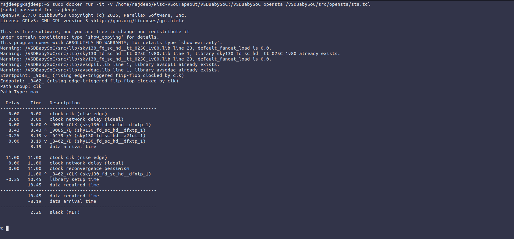

### **VSDBabySoC PVT Corner Analysis (Post-Synthesis Timing)**

Post-synthesis **PVT (Process, Voltage, Temperature) corner analysis** evaluates the timing performance of the VSDBabySoC under **different manufacturing, voltage, and temperature conditions**. It helps identify worst-case and best-case scenarios to ensure the design meets timing requirements across all operating conditions.

**Timing libraries**: 🔗 https://github.com/efabless/skywater-pdk-libs-sky130_fd_sc_hd/tree/master/timing

### **Automated STA PVT Corners Analysis**

sta_pvt.tcl

```bash
 # List of standard cell liberty files
set list_of_lib_files(1) "sky130_fd_sc_hd__tt_025C_1v80.lib"
set list_of_lib_files(2) "sky130_fd_sc_hd__ff_100C_1v65.lib"
set list_of_lib_files(3) "sky130_fd_sc_hd__ff_100C_1v95.lib"
set list_of_lib_files(4) "sky130_fd_sc_hd__ff_n40C_1v56.lib"
set list_of_lib_files(5) "sky130_fd_sc_hd__ff_n40C_1v65.lib"
set list_of_lib_files(6) "sky130_fd_sc_hd__ff_n40C_1v76.lib"
set list_of_lib_files(7) "sky130_fd_sc_hd__ss_100C_1v40.lib"
set list_of_lib_files(8) "sky130_fd_sc_hd__ss_100C_1v60.lib"
set list_of_lib_files(9) "sky130_fd_sc_hd__ss_n40C_1v28.lib"
set list_of_lib_files(10) "sky130_fd_sc_hd__ss_n40C_1v35.lib"
set list_of_lib_files(11) "sky130_fd_sc_hd__ss_n40C_1v40.lib"
set list_of_lib_files(12) "sky130_fd_sc_hd__ss_n40C_1v44.lib"
set list_of_lib_files(13) "sky130_fd_sc_hd__ss_n40C_1v76.lib"

# Read custom analog IP timing libraries (PLL and DAC)
read_liberty /VSDBabySoC/src/lib/avsdpll.lib
read_liberty /VSDBabySoC/src/lib/avsddac.lib

 # Loop over standard cell libraries
    for {set i 1} {$i <= [array size list_of_lib_files]} {incr i} {
    read_liberty /VSDBabySoC/src/timing_lib/sky130_fd_sc_hd_timing/timing/$list_of_lib_files($i)
# Read synthesized Verilog netlist
    read_verilog /VSDBabySoC/output/post_synth_sim/vsdbabysoc.synth.v
    link_design vsdbabysoc
    current_design
    read_sdc /VSDBabySoC/src/sdc/vsdbabysoc_synthesis.sdc

    check_setup -verbose

    report_checks -path_delay min_max -fields {nets cap slew input_pins fanout} -digits {4} \
        >  /VSDBabySoC/src/opensta_output/min_max_$list_of_lib_files($i).txt

    exec echo "$list_of_lib_files($i)" >> /VSDBabySoC/src/opensta_output/sta_worst_max_slack.txt
    report_worst_slack -max -digits {4} >> /VSDBabySoC/src/opensta_output/sta_worst_max_slack.txt

    exec echo "$list_of_lib_files($i)" >> /VSDBabySoC/src/opensta_output/sta_worst_min_slack.txt
    report_worst_slack -min -digits {4} >> /VSDBabySoC/src/opensta_output/sta_worst_min_slack.txt

    exec echo "$list_of_lib_files($i)" >> /VSDBabySoC/src/opensta_output/sta_tns.txt
    report_tns -digits {4} >> /VSDBabySoC/src/opensta_output/sta_tns.txt

    exec echo "$list_of_lib_files($i)" >> /VSDBabySoC/src/opensta_output/sta_wns.txt
    report_wns -digits {4} >> /VSDBabySoC/src/opensta_output/sta_wns.txt
}
```

🔹 OpenSTA TCL Commands in Post-Synthesis STA Flow

| **Command / Script Segment** | **Purpose / Description** |
| --- | --- |
| `set list_of_lib_files(...)` | Defines an **array of standard cell liberty files** for different PVT corners (Process, Voltage, Temperature). |
| `read_liberty <file>` | Loads a **standard cell or custom IP library** (.lib) containing timing information. Separate libraries can be for min, max, or typical corners. |
| `read_verilog <file>` | Reads the **synthesized gate-level Verilog netlist** of the design. |
| `link_design <design_name>` | Initializes and links the design in OpenSTA for timing analysis. |
| `current_design` | Ensures subsequent commands are applied to the **currently active design**. |
| `read_sdc <file>` | Loads **timing constraints** (clock definitions, input/output delays, false/multicycle paths) from an SDC file. |
| `check_setup -verbose` | Performs **setup timing checks** on all paths, showing detailed violation information. |
| `report_checks -path_delay min_max -fields {...} -digits {4} > <file>` | Generates a **detailed timing report** for min/max path delays, including parameters like nets, capacitance, slew, fanout, etc., and saves it to a file. |
| `exec echo "$list_of_lib_files($i)" >> <file>` | Writes the **current library name** to an output file, used for labeling results. |
| `report_worst_slack -max -digits {4} >> <file>` | Reports the **maximum slack** across all paths for the current library and appends it to a file. |
| `report_worst_slack -min -digits {4} >> <file>` | Reports the **minimum slack** (critical path) for the current library and appends it to a file. |
| `report_tns -digits {4} >> <file>` | Reports the **Total Negative Slack (TNS)** for the design under the current library corner. |
| `report_wns -digits {4} >> <file>` | Reports the **Worst Negative Slack (WNS)**, indicating the most critical timing violation in the design. |
| `for {set i 1} {$i <= [array size list_of_lib_files]} {incr i} {...}` | Loops over all libraries to perform timing analysis for **different PVT corners**, generating separate reports for each library. |

**Run the Automated Script**

```bash
rajdeep@Rajdeep:~$ sudo docker run -it -v /home/rajdeep/Risc-VSoCTapeout/VSDBabySoC:/VSDBabySoC opensta /VSDBabySoC/src/opensta/sta_pvt.tcl
```

📂 **Generated Output Directory:**

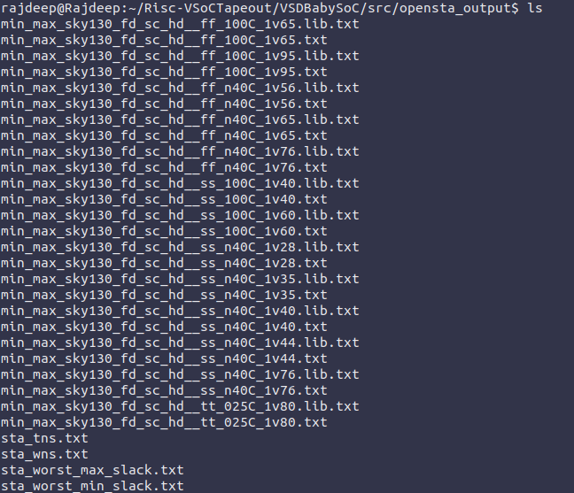

| **🗂️ File Name** | **📘 Description** |
| --- | --- |
| `min_max_<lib>.txt` | Detailed timing report for each PVT corner |
| `sta_worst_max_slack.txt` | Worst setup slack across corners |
| `sta_worst_min_slack.txt` | Worst hold slack across corners |
| `sta_tns.txt` | Total Negative Slack summary |
| `sta_wns.txt` | Worst Negative Slack summary |

### **📈 6. Timing Summary & Visualizations**

The following plots summarize the timing results across 13 PVT corners.

**Worst Hold Slack:**

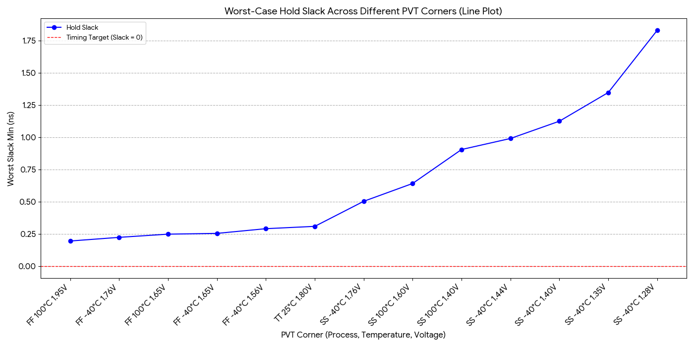

**Worst Setup Slack:**

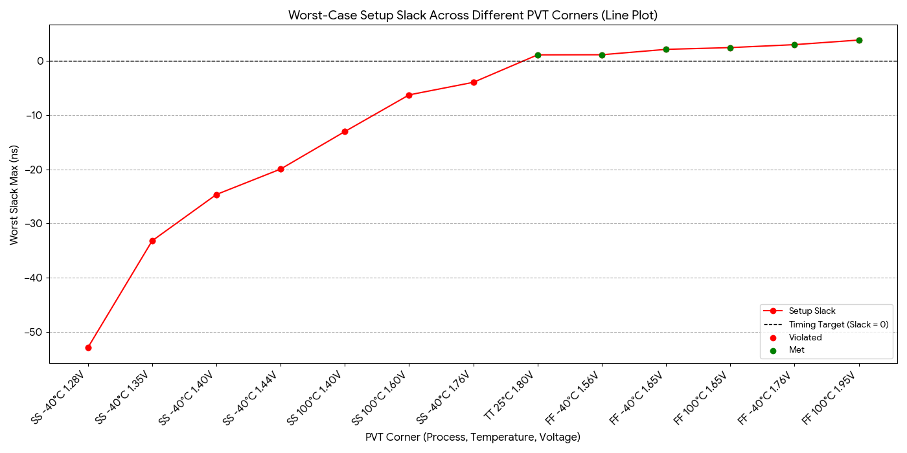

**WNS (Worst Negative Slack):**

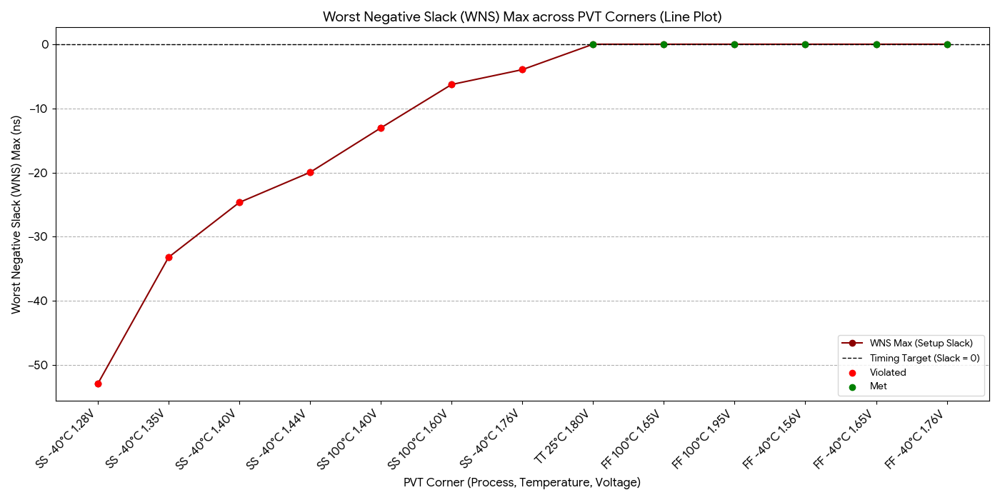

**TNS(Total Negative Slack) :**

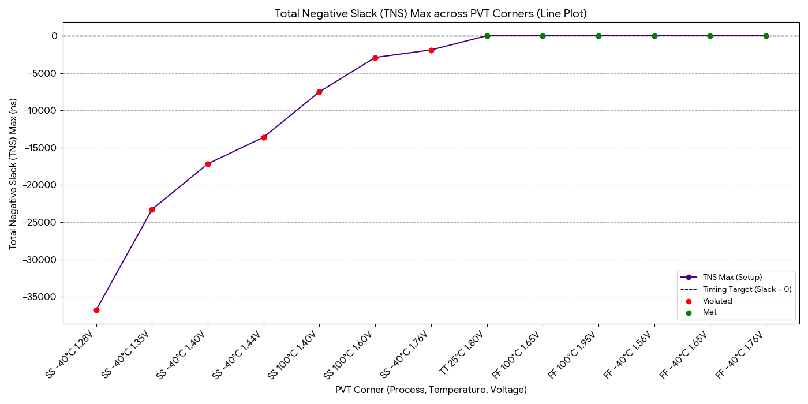

✅ **Final Summary:**

With the above scripts and automation, the VSDBabySoC STA flow provides:

- Reliable timing verification across **all PVT corners**
- Precise **setup and hold checks** for all timing paths
- Fully **reproducible analysis** in a Docker-based environment
