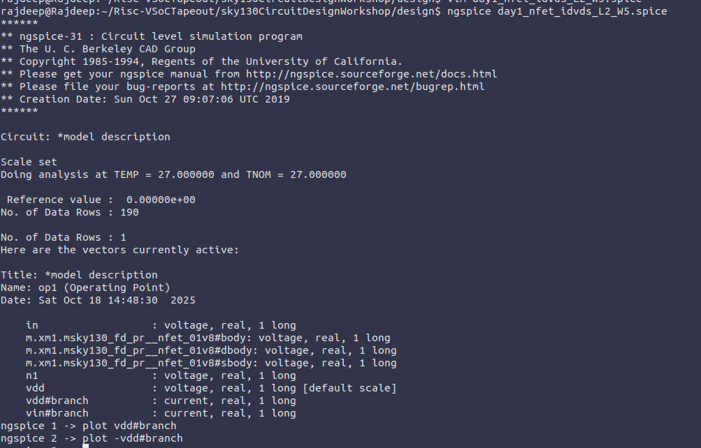
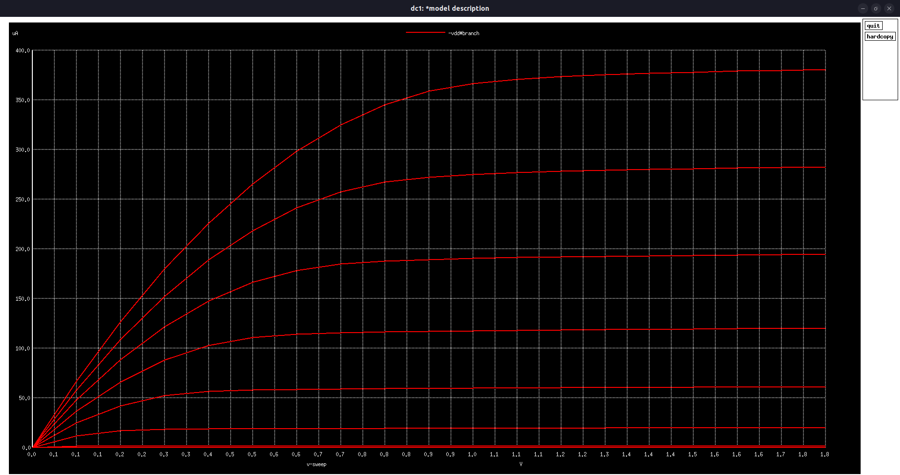
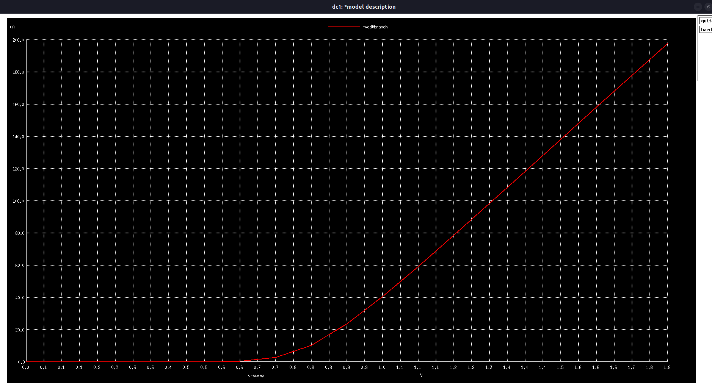
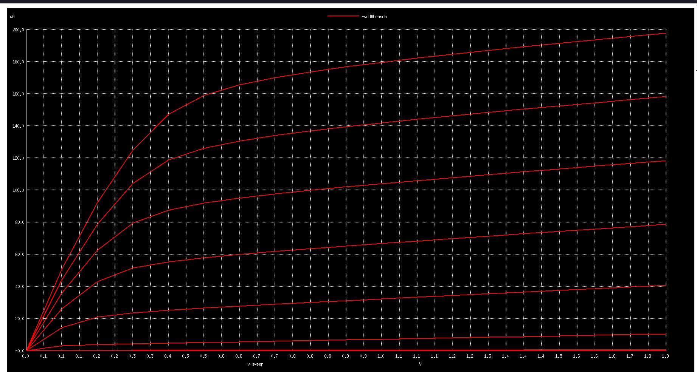
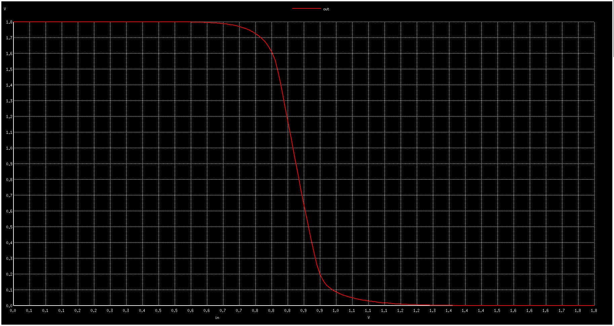
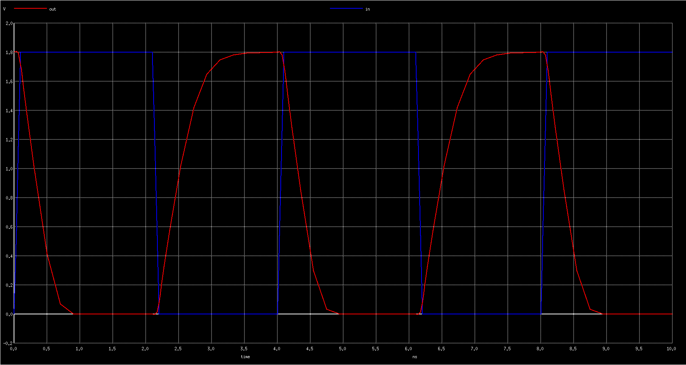
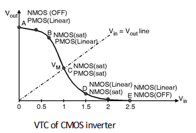
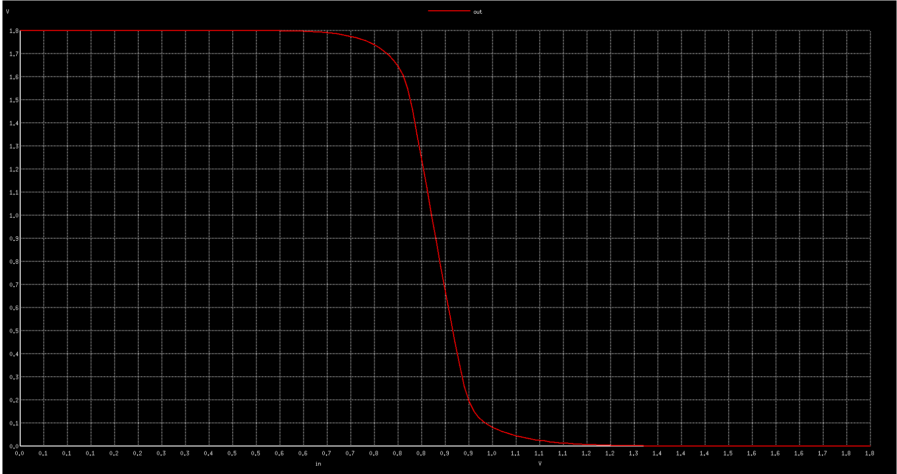
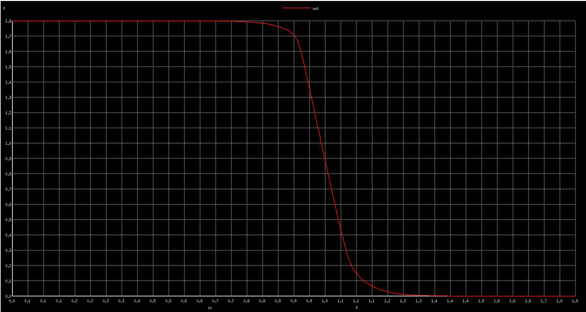
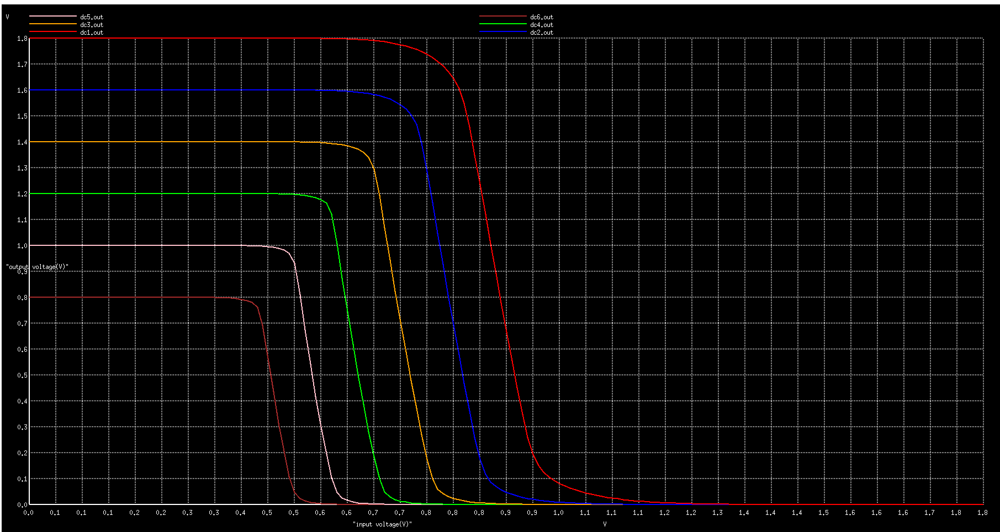

# ⚡ VSDIAT SPICE Simulation

---

## ⚙️ Setup and Environment Configuration

Setting up the simulation environment and obtaining all required files from the Sky130 Circuit Design Workshop repository are described in the steps that follow.

### 🧩 Step 1: Clone the Workshop Repository

Start by using the Git command-line tool to clone the repository containing all of the necessary simulation files, netlists, and SPICE models.

```bash
# Clone the repository containing Sky130 circuit design collateral
git clone https://github.com/kunalg123/sky130CircuitDesignWorkshop.git

# Navigate into the cloned directory
cd sky130CircuitDesignWorkshop/design
```

## **1️⃣ MOSFET Behavior & Id vs. Vds Characteristics**

## 🎯 **Objective**

-To map out the **fundamental operating regions** (linear and saturation) of a MOSFET. This shows how channel current ($I_D$) is controlled by both $V_{GS}$ and $V_{DS}$.

## SPICE Netlists / Code

```bash
*Model Description
.param temp=27

*Including sky130 library files
.lib "sky130_fd_pr/models/sky130.lib.spice" tt

*Netlist Description

XM1 Vdd n1 0 0 sky130_fd_pr__nfet_01v8 w=5 l=2
R1 n1 in 55
Vdd vdd 0 1.8V
Vin in 0 1.8V

*Simulation Commands
.op
.dc Vdd 0 1.8 0.1 Vin 0 1.8 0.2

.control
run
display
setplot dc1
.endc

.end

```

## 📊 **Simulation Results and Plots**

 Steps for plot Id vs Vds curve



## Id vs Vds Curve:

The $I_D$–$V_{DS}$ characteristics show how the drain current varies with the drain-to-source voltage for different $V_{GS}$ values.

It helps identify the MOSFET’s operating regions — cutoff, triode, and saturation.



## **Observations / Analysis: ID vs VDS**

**1️⃣ What I see:**

- At low VDS, the MOSFET operates in the **linear (ohmic) region**, where ID increases almost linearly with VDS.
- Beyond a certain VDS (VDSsat = VGS - VT), the transistor enters **saturation**, and ID becomes almost constant.
- The **saturation current (ID,sat)** increases with higher VGS.

**2️⃣ Why it happens (device physics):**

- **Linear region:** The channel is fully formed, and current is controlled by VDS and channel resistance.
- **Saturation region:** The channel pinches off near the drain; current is controlled mainly by VGS and weakly depends on VDS.
- **Effect of VGS:** Higher VGS enhances channel inversion → higher ID in both regions.

**3️⃣ STA relevance:**

- **Drive strength:** ID,sat defines how fast a transistor can charge/discharge a load capacitance → directly impacts **propagation delay** of gates.
- **Delay modeling:** Linear vs saturation behavior is critical for accurate **transistor-level delay estimation** in STA libraries.
- **Corner analysis:** Variations in ID (due to VGS or process) affect **critical path timing** in circuits.

## **2️⃣** Threshold Voltage Extraction & Velocity Saturation

## 🎯 **Objective**
It determines the gate-source voltage (VT) required to turn on the MOSFET and observes short-channel effects, such as velocity saturation, that influence the transistor’s current and switching behavior.

## **💻 SPICE Netlists and Code**

**1️⃣ Id Vs Vgs NGSpice Code:** 

```bash
*Model Description
.param temp=27

*Including sky130 library files
.lib "sky130_fd_pr/models/sky130.lib.spice" tt

*Netlist Description

XM1 Vdd n1 0 0 sky130_fd_pr__nfet_01v8 w=0.39 l=0.15

R1 n1 in 55

Vdd vdd 0 1.8V
Vin in 0 1.8V

*simulation commands

.op
.dc Vin 0 1.8 0.1

.control

run
display
setplot dc1
.endc

.end
```

**2️⃣ Id Vs Vds(for Short Channel) NGSpice Code:**

```bash
*Model Description
.param temp=27

*Including sky130 library files
.lib "sky130_fd_pr/models/sky130.lib.spice" tt

*Netlist Description
XM1 Vdd n1 0 0 sky130_fd_pr__nfet_01v8 w=0.39 l=0.15

R1 n1 in 55

Vdd vdd 0 1.8V
Vin in 0 1.8V

*simulation commands

.op
.dc Vdd 0 1.8 0.1 Vin 0 1.8 0.2

.control

run
display
setplot dc1
.endc
.end
```

## 📊 **Simulation Results and Plots**

**1️⃣ Id Vs Vgs Graph:**



- **Threshold Voltage** : 0.6 V

**2️⃣  Id Vs Vds Graph(Short Channel):**



## 🔬 **Observations & Analysis:**

**1️⃣ What you see:**

- In the **ID vs VGS curve**, the MOSFET current starts to rise sharply once VGS exceeds the threshold voltage (VT). Below VT, the transistor is in **cutoff**, and ID is nearly zero.
- In the **ID vs VDS curve**, at high VDS, the current saturates more sharply than expected due to **velocity saturation**, especially for higher VGS values.

**2️⃣ Why it happens (device physics):**

- **Threshold behavior:** Below VT, the channel is not formed, preventing conduction. Above VT, an inversion layer forms and current flows. Short-channel effects can slightly shift or reduce VT.
- **Velocity saturation:** In short-channel MOSFETs, carriers reach maximum drift velocity under strong electric fields, limiting ID even if VDS increases further.

**3️⃣ STA relevance:**

- **VT sets turn-on behavior**, affecting the drive current and inverter switching speed. Variations in VT impact **cell delay** and **critical path timing**.
- **Velocity saturation reduces effective drive current**, slightly increasing **propagation delays**, which must be considered for **accurate STA modeling** in high-speed or deep-submicron circuits.
- 

## CMOS Inverter

## 3️⃣ Voltage Transfer Characteristic (VTC)

## 🎯 **Objective**

To build a CMOS inverter using PMOS and NMOS transistors, sweep the input voltage (V_IN), and plot the output voltage (V_OUT) to identify the **switching threshold (V_M)**, where V_IN = V_OUT.

## **💻 SPICE Netlists and Code**

```bash
*Model Description
.param temp=27

*Including sky130 library files
.lib "sky130_fd_pr/models/sky130.lib.spice" tt

*Netlist Description

XM1 out in vdd vdd sky130_fd_pr__pfet_01v8 w=0.84 l=0.15
XM2 out in 0 0 sky130_fd_pr__nfet_01v8 w=0.36 l=0.15

Cload out 0 50fF

Vdd vdd 0 1.8V
Vin in 0 1.8V

*simulation commands

.op

.dc Vin 0 1.8 0.01

.control
run
setplot dc1
display
.endc

.end

```

## 📊 **Simulation Results and Plots**

### **Vout vs Vin Plot:**



- **Switching Threshold** = 0.8769 v

## **4️⃣ Transient Behavior: Rise and Fall Delays**

### 🎯 **Objective**

To analyze the **dynamic switching response**of a CMOS inverter by applying a pulse input and measuring the **rise (t<sub>pLH</sub>)** and**fall (t<sub>pHL</sub>)** propagation delays. This helps in understanding how quickly the inverter output transitions between logic states and how these delays affect the overall circuit speed.

## **💻 SPICE Netlists and Code**

```bash
*Model Description
.param temp=27

*Including sky130 library files
.lib "sky130_fd_pr/models/sky130.lib.spice" tt

*Netlist Description

XM1 out in vdd vdd sky130_fd_pr__pfet_01v8 w=0.84 l=0.15
XM2 out in 0 0 sky130_fd_pr__nfet_01v8 w=0.36 l=0.15

Cload out 0 50fF

Vdd vdd 0 1.8V
Vin in 0 PULSE(0V 1.8V 0 0.1ns 0.1ns 2ns 4ns)

*simulation commands

.tran 1n 10n

.control
run
.endc

.end
```

## 📊 **Simulation Results and Plots**



 **Points from the plot:**
**Rise Transition:**

- `x1 = 2.15069 × 10⁻⁹ s`
- `x2 = 2.48264 × 10⁻⁹ s`

**Fall Transition:**

- `x1 = 4.05 × 10⁻⁹ s`
- `x2 = 4.33515 × 10⁻⁹ s`

| Delay Type | Calculation | Value (ps) |
| --- | --- | --- |
| Rise (`t_pLH`) | (2.48264 − 2.15069) × 10⁻⁹ | **331.95 ps** |
| Fall (`t_pHL`) | (4.33515 − 4.05) × 10⁻⁹ | **285.15 ps** |

## **5️⃣ Noise Margin / Robustness Analysis**

### 🎯 **Objective**

To determine the noise margins of a CMOS inverter by analyzing its Voltage Transfer Characteristic (VTC) and identifying the critical points — $V_{IL}$, $V_{IH}$, $V_{OL}$, and $V_{OH}$. This experiment quantifies the circuit’s tolerance to input voltage noise, ensuring reliable logic-level recognition and robust digital operation.



## **💻 SPICE Netlists and Code**

```bash
*Model Description
.param temp=27

*Including sky130 library files
.lib "sky130_fd_pr/models/sky130.lib.spice" tt

*Netlist Description

XM1 out in vdd vdd sky130_fd_pr__pfet_01v8 w=1 l=0.15
XM2 out in 0 0 sky130_fd_pr__nfet_01v8 w=0.36 l=0.15

Cload out 0 50fF

Vdd vdd 0 1.8V
Vin in 0 1.8V

*simulation commands

.op

.dc Vin 0 1.8 0.01

.control
run
setplot dc1
display
.endc

.end

```

## 📊 **Simulation Results and Plots**



### Values taken from the graph:

- **`VOH`** = 1.73617 V
- **`VOL`** = 0.0744681 V
- **`VIL`** = 0.754167 V
- **`VIH`** = 0.998958 V

---

### 🧮 **Noise Margin Results**

| Parameter | Formula | Calculated Value (V) | Interpretation |
| --- | --- | --- | --- |
| **`NMH`** | `VOH − VIH` | **0.737** | Tolerance for noise on logic HIGH |
| **`NML`** | `VIL − VOL` | **0.680** | Tolerance for noise on logic LOW |

## 6️⃣ Power-Supply and Device Variation Studies

**Objective:**

To investigate how **variations in power supply voltage (V<sub>DD</sub>)** and **device parameters** such as **W/L ratio** affect the **Voltage Transfer Characteristic (VTC)**, **switching threshold**, **delay**, and **noise margins** of a CMOS inverter. This experiment demonstrates how real-world **process, voltage, and temperature (PVT)** variations influence circuit timing and reliability in digital design.

## **💻 SPICE Netlists and Code**

### **Device Variation:**

```bash
*Model Description
.param temp=27

*Including sky130 library files
.lib "sky130_fd_pr/models/sky130.lib.spice" tt

*Netlist Description

XM1 out in vdd vdd sky130_fd_pr__pfet_01v8 w=7 l=0.15
XM2 out in 0 0 sky130_fd_pr__nfet_01v8 w=0.42 l=0.15

Cload out 0 50fF

Vdd vdd 0 1.8V
Vin in 0 1.8V

*simulation commands

.op

.dc Vin 0 1.8 0.01

.control
run
setplot dc1
display
.endc

.end
```

## 📊 **Simulation Results and Plots**



**Switching Threshold** = 0.989 V

### Points after Device variation( W change from 1 ⇒7 )
- **`VOH`** = 1.73191 V
- **`VOL`** = 0.0574468 V
- **`VIL`** = 0.8875 V
- **`VIH`** = 1.15312 V

---

### 🧮 **Noise Margin Results (After Device Variation)**

| Parameter | Formula | Calculated Value (V) | Interpretation |
| --- | --- | --- | --- |
| **`NMH`** | `VOH − VIH` | **0.579** | Noise tolerance for logic HIGH (reduced) |
| **`NML`** | `VIL − VOL` | **0.830** | Noise tolerance for logic LOW (increased) |


### **Supply Variation:**

```bash
*Model Description
.param temp=27

*Including sky130 library files
.lib "sky130_fd_pr/models/sky130.lib.spice" tt

*Netlist Description

XM1 out in vdd vdd sky130_fd_pr__pfet_01v8 w=1 l=0.15
XM2 out in 0 0 sky130_fd_pr__nfet_01v8 w=0.36 l=0.15

Cload out 0 50fF

Vdd vdd 0 1.8V
Vin in 0 1.8V

.control

let powersupply = 1.8
alter Vdd = powersupply
	let voltagesupplyvariation = 0
	dowhile voltagesupplyvariation < 6
	dc Vin 0 1.8 0.01
	let powersupply = powersupply - 0.2
	alter Vdd = powersupply
	let voltagesupplyvariation = voltagesupplyvariation + 1
      end
 
plot dc1.out vs in dc2.out vs in dc3.out vs in dc4.out vs in dc5.out vs in dc6.out vs in xlabel "input voltage(V)" ylabel "output voltage(V)" title "Inveter dc characteristics as a function of supply voltage"

.endc

.end
```

## **📊 Simulation Results and Plots**



### Noise Margin for Supply Variations:

| **VDD (V)** | **VOH (V)** | **VOL (V)** | **VIL (V)** | **VIH (V)** | **NM_H = VOH − VIH (V)** | **NM_L = VIL − VOL (V)** |
| --- | --- | --- | --- | --- | --- | --- |
| 1.8 | 1.72979 | 0.0851064 | 0.757292 | 1.00000 | 0.72979 | 0.672186 |
| 1.6 | 1.54894 | 0.0531915 | 0.695833 | 0.89375 | 0.65519 | 0.642642 |
| 1.4 | 1.36170 | 0.0553190 | 0.628125 | 0.77500 | 0.58670 | 0.572806 |
| 1.2 | 1.17872 | 0.0361702 | 0.550000 | 0.676042 | 0.50268 | 0.513830 |
| 1.0 | 0.97234 | 0.0319149 | 0.485417 | 0.58640 | 0.38594 | 0.453502 |
| 0.8 | 0.791489 | 0.0255319 | 0.401042 | 0.51250 | 0.278989 | 0.375510 |

### **Observations / Analysis:**

**1️⃣ What you see:**

- **Device variation:** Changing transistor dimensions or threshold voltages shifts the switching point, resulting in **NM<sub>H</sub> decreasing** and **NM<sub>L</sub> increasing**, which introduces an **asymmetry in noise tolerance**. Despite this, the inverter still maintains acceptable operation, showing **robustness against moderate device variations**.
- **Supply variation:** As VDD decreases from 1.8 V to 0.8 V, both **NM<sub>H</sub> and NM<sub>L</sub> reduce**, compressing the voltage window for logic HIGH and LOW. The circuit becomes more sensitive to noise, indicating **reduced robustness at lower supply voltages**.

**2️⃣ Why it happens (device physics):**

- **Device variation:** Altered W/L ratios or threshold voltages change the relative drive strengths of PMOS and NMOS, shifting the VTC curve and modifying noise margins.
- **Supply variation:** Lower VDD reduces the output swing (VOH − VOL), narrowing the voltage window for reliable logic recognition, which decreases the inverter’s **noise tolerance**.

**3️⃣ STA relevance & robustness:**

- Noise margin reductions and asymmetries affect **logic reliability** under worst-case conditions, making some paths more prone to errors.
- STA must consider **PVT (process, voltage, temperature) corners** to ensure **robust timing and functional correctness**.
- Evaluating NM under device and supply variations provides insight into **the inverter’s robustness**, helping designers maintain **stable operation and sufficient timing margins** in digital circuits.

---
